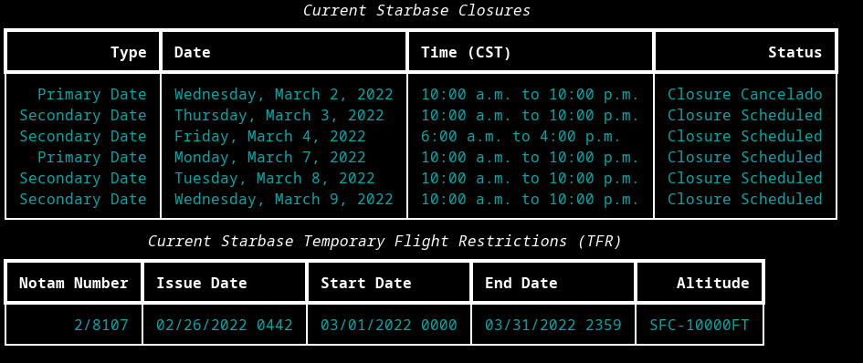

# Starbase-Hub
SpaceX Starbase Closure Terminal App

## Screenshots



## Installing 

Install the rich terminal library.
For windows:
```sh
python -m pip install rich
```
For linux
```sh
pip3 install rich
```
Run this command in the starbase-hub directory to install the application
```sh
pip install .
```
Run this command in terminal to retrieve the latest highway 4 road closures and temporary flight restrictions
```sh
closures
```
